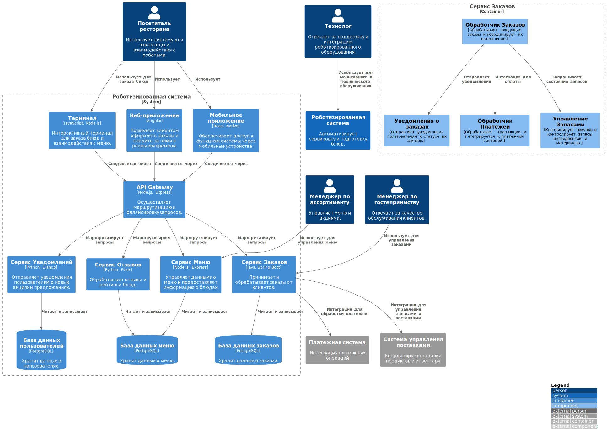

# Архитектурный стиль

## Обоснование выбора архитектурного стиля

Выбор микросервисной архитектуры для системы управления сетью роботизированных ресторанов "Робот и точка" обусловлен несколькими важными причинами:

- **Независимость разработки и развертывания:** Микросервисы позволяют разрабатывать и развертывать каждую функцию системы независимо, что способствует более быстрому внедрению изменений и упрощает управление проектом.
- **Улучшенная масштабируемость:** Каждый сервис можно масштабировать отдельно в зависимости от требований, что критически важно для системы, предназначенной для обслуживания переменного количества запросов в разные периоды времени.
- **Устойчивость к отказам:** В микросервисной архитектуре сбой одного сервиса не приводит к остановке всей системы, что обеспечивает высокую доступность и надежность сервиса.
- **Технологическая гибкость:** Микросервисы могут быть разработаны с использованием различных технологий, что позволяет выбирать оптимальные решения для каждой задачи, улучшая производительность и удобство работы.
- **Легкость интеграции и автономия:** Микросервисы легко интегрировать с другими внешними системами и сервисами, что важно для современных ресторанов, использующих разнообразные технологические решения для улучшения качества обслуживания и взаимодействия с клиентами.

Таким образом, микросервисная архитектура обеспечивает эффективное и гибкое управление роботизированными ресторанами, повышает устойчивость системы к ошибкам, ускоряет процесс разработки и поддерживает легкую интеграцию с разнообразными компонентами и устройствами.

### Описание компонентов

| Компонент              | Технология       | Описание                                                                                 |
|------------------------|------------------|------------------------------------------------------------------------------------------|
| **Веб-приложение**     | Angular          | Предоставляет интерфейс для заказов клиентами через веб-браузер.                         |
| **Мобильное приложение** | React Native    | Обеспечивает доступ к функциям системы через мобильные устройства для заказа и взаимодействия с системой. |
| **API Gateway**        | Node.js, Express | Осуществляет маршрутизацию и балансировку всех входящих запросов к сервисам.             |
| **Сервис Заказов**     | Java, Spring Boot| Обрабатывает все операции, связанные с заказами, включая прием, обработку и отслеживание статуса заказов. |
| **Сервис Лояльности**  | Python, Django   | Управляет программами лояльности и промо-акциями, предлагая скидки и специальные предложения для клиентов. |
| **База данных**        | PostgreSQL       | Хранит все необходимые данные, включая информацию о пользователях, заказах, меню и транзакциях. |
| **Обработчик Заказов** |                  | Компонент в Сервисе Заказов, отвечающий за управление и выполнение заказов.              |
| **Процессор Платежей** |                  | Компонент в Сервисе Заказов для обработки платежей, интегрируется с внешними платежными системами. |
| **Управление Запасами**|                  | Управляет запасами продуктов и ингредиентов, координируя закупки и контролируя запасы.   |
| **Сервис Управления Рестораном** | C#, .NET | Обеспечивает функции управления рестораном, включая обслуживание клиентов и взаимодействие с роботами. |
| **Сервис Контроля Роботов** | Python, Flask | Отвечает за управление роботами, их мониторинг и координацию их действий в ресторане.    |
| **База данных ресторана** | Oracle        | Хранит расширенные данные о действиях ресторана, включая операционные данные и логи работы роботов. |

### Модель С4

