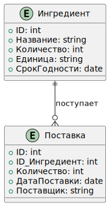
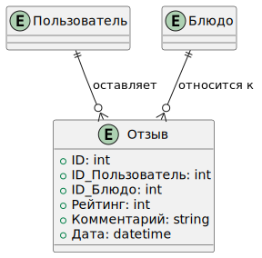

# Проектирование приложения

## Концептуальная модель данных

## Логическая модель данных

| Сервис              | Модель       | 
|------------------------|------------------|
| **Сервис Пользователей**     |  | 
| **Сервис Заказов** |  |
| **Сервис меню**        |  |
| **Сервис склада**     |  |
| **Сервис отзывов**     |  |

## Физическая модель данных для всех сервисов

