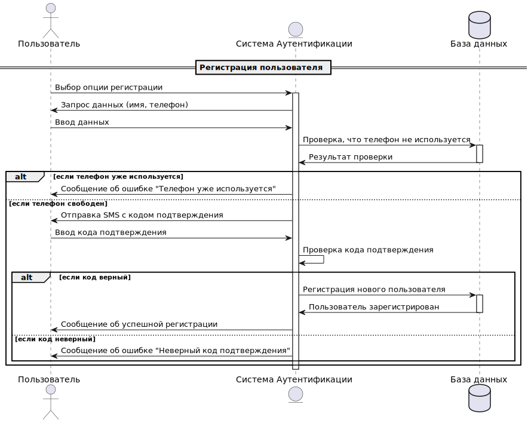
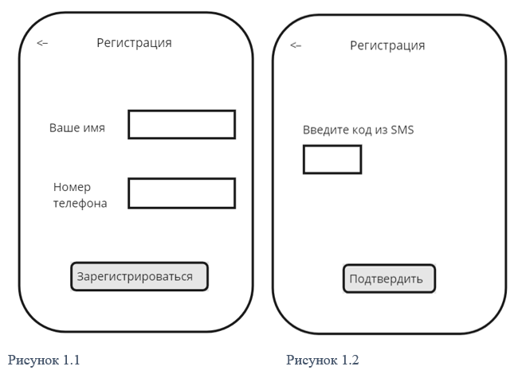
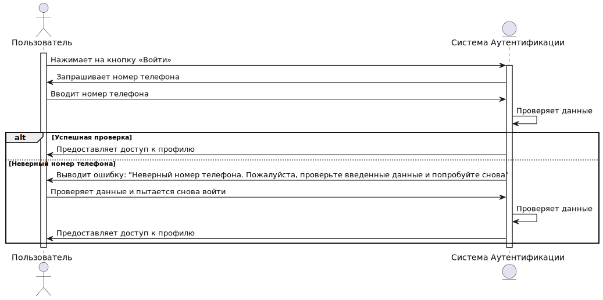
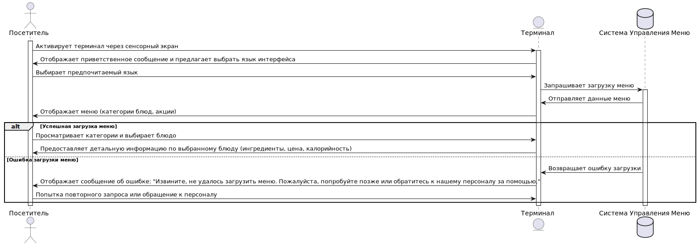
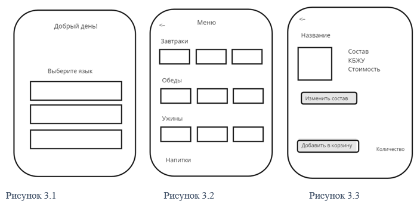
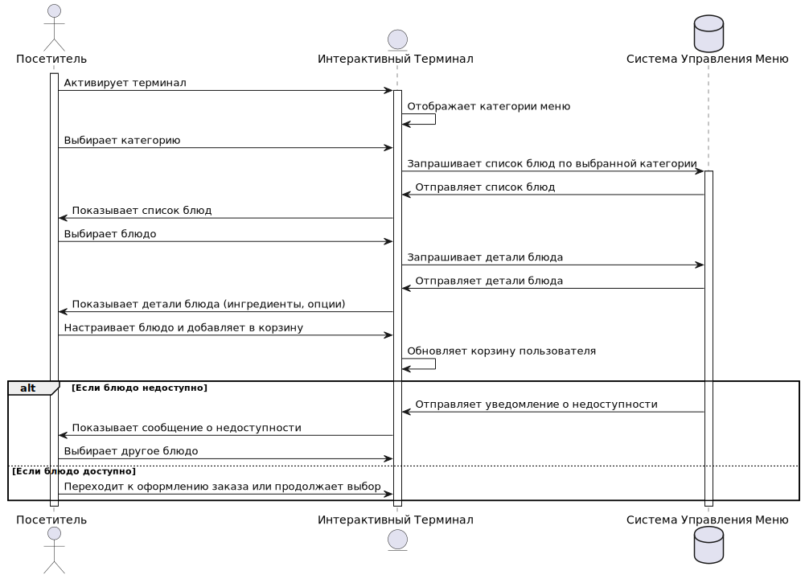
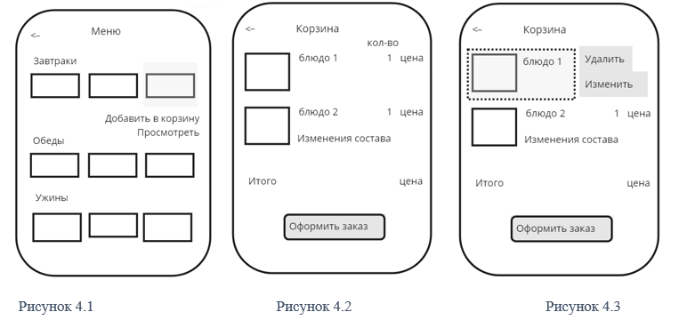
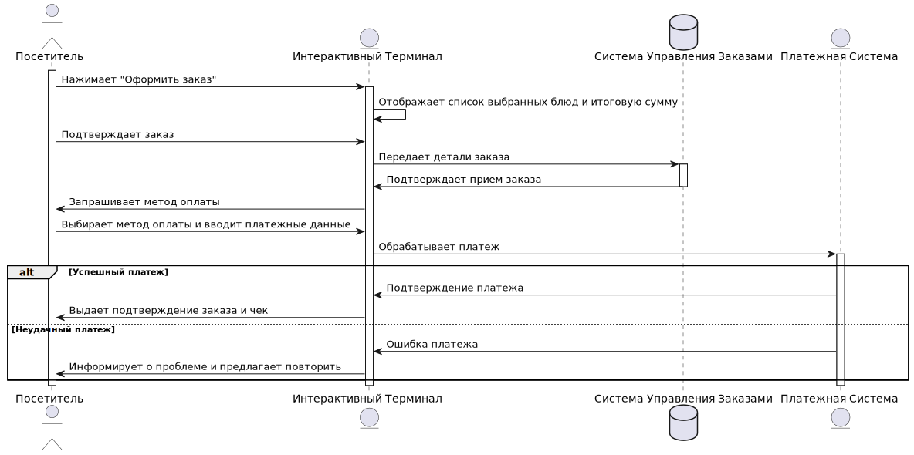

# Функциональные требования

Диаграмма Use Case

## UseCases в рамках MVP

### UC1: Регистрация пользователя

| Атрибут           | Описание                                                                 |
|-------------------|--------------------------------------------------------------------------|
| **ID и название** | UC1: Регистрация пользователя                                            |
| **Описание**      | Позволяет новым пользователям создать учетную запись в системе.         |
| **Основные акторы** | Потенциальные пользователи                                             |
| **Второстепенные акторы** | Система аутентификации                                          |
| **Предусловия**   | Пользователь не должен быть зарегистрирован в системе.                   |
| **Основной поток событий** | 1. Пользователь выбирает опцию регистрации. 2. Вводит требуемые данные (имя, телефон). 3. Подтверждает регистрацию через смс на номер телефона. 4. Система регистрирует пользователя. |
| **Альтернативный поток событий** | 1. Пользователь выбирает опцию регистрации. 2. Вводит имя и номер телефона. 3. Нажимает на кнопку для подтверждения регистрации. 4. Система проверяет номер телефона в базе данных на предмет его наличия. 5. Номер телефона уже зарегистрирован в системе, пользователю отображается сообщение об ошибке: «Этот номер телефона уже используется. Пожалуйста, введите другой номер». 6. Процесс регистрации начинается заново с выбора опции регистрации. |
| **Постусловия**   | Пользователь успешно зарегистрирован и может войти в систему.            |
| **Триггеры**      | Пользователь выбирает "Зарегистрироваться".                              |
| **Исключения**    | Номер телефона уже используется в системе.                               |
| **Частота использования** | По мере появления новых пользователей.                           |
| **Диаграмма** | { width="100" }                                  |
| **Макеты** |                                       |

### UC2: Вход в систему

| Атрибут           | Описание                                                                 |
|-------------------|--------------------------------------------------------------------------|
| **ID и название** | UC2: Вход в систему                                                      |
| **Описание**      | Аутентификация пользователя для доступа к системе.                      |
| **Основные акторы** | Зарегистрированные пользователи                                       |
| **Второстепенные акторы** | Система аутентификации                                          |
| **Предусловия**   | Пользователь должен быть зарегистрирован.                               |
| **Основной поток событий** | 1. Пользователь нажимает на кнопку «Войти». 2. Пользователь вводит номер телефона. 3. Система проверяет данные. 4. Пользователь получает доступ к своему профилю. |
| **Альтернативный поток событий** | 1. Пользователь вводит номер телефона и нажимает на кнопку «Войти». 2. Система проверяет введенные данные и не находит соответствия номера телефона в базе данных. 3. Система отображает сообщение об ошибке: «Неверный номер телефона. Пожалуйста, проверьте введенные данные и попробуйте снова». 4. Пользователь возвращается к форме входа и проверяет введенные данные. 5. Пользователь корректирует номер телефона, если была допущена ошибка, и снова нажимает на кнопку «Войти». 6. Если номер телефона введен правильно, система предоставляет доступ к профилю пользователя. |
| **Постусловия**   | Пользователь успешно входит в систему.                                  |
| **Триггеры**      | Пользователь выбирает "Войти".                                          |
| **Исключения**    | Неверный номер телефона                                                 |
| **Частота использования** | Каждый раз при попытке пользователя войти в систему.            |
| **Диаграмма** | { width="100" }            |
| **Макеты** |                                       |

### UC3: Просмотр меню через терминал

| Атрибут           | Описание                                                                 |
|-------------------|--------------------------------------------------------------------------|
| **ID и название** | UC3: Просмотр меню через терминал                                        |
| **Описание**      | Пользователь может просматривать текущее меню ресторана через интерактивный терминал, доступный в ресторане. Это позволяет узнавать о доступных блюдах, их ценах и ингредиентах перед заказом. |
| **Основные акторы** | Посетители ресторана                                                   |
| **Второстепенные акторы** | Система управления меню                                          |
| **Предусловия**   | • Терминал должен быть включен и функционировать. • Меню должно быть актуальным и загруженным в систему управления меню. |
| **Основной поток событий** | 1. Посетитель подходит к терминалу и активирует его через сенсорный экран. 2. Терминал отображает приветственное сообщение и предлагает выбрать язык интерфейса. 3. Посетитель выбирает предпочитаемый язык. 4. Терминал загружает и отображает меню, включая категории блюд (например, закуски, основные блюда, десерты) и акции. 5. Посетитель просматривает различные категории и блюда. 6. Терминал предоставляет детальную информацию по выбранному блюду по запросу клиента (ингредиенты, цена, калорийность). 7. Посетитель может вернуться к списку категорий или завершить просмотр и выйти из системы. |
| **Альтернативный поток событий** | 1. Посетитель активирует терминал и выбирает язык интерфейса. 2. Терминал пытается загрузить меню, но процесс завершается с ошибкой из-за технической проблемы (например, отсутствие связи с сервером). 3. Терминал отображает сообщение об ошибке: "Извините, не удалось загрузить меню. Пожалуйста, попробуйте позже или обратитесь к нашему персоналу за помощью." 4. Посетитель может либо попытаться повторить запрос, либо обратиться к персоналу ресторана. |
| **Постусловия**   | • Посетитель получает необходимую информацию о меню. • Терминал готов к использованию следующим посетителем. |
| **Триггеры**      | Посетитель начинает взаимодействие с терминалом.                         |
| **Исключения**    | Если меню не загружается или доступно из-за технических проблем, терминал отображает сообщение об ошибке и предлагает повторить попытку позже или обратиться к персоналу. |
| **Частота использования** | Может использоваться множество раз в течение дня.                |
| **Диаграмма** | { width="100" }            |
| **Макеты** |                                       |

### UC4: Интерактивный выбор и добавление блюд в корзину

| Атрибут           | Описание                                                                 |
|-------------------|--------------------------------------------------------------------------|
| **ID и название** | UC4: Интерактивный выбор и добавление блюд в корзину                     |
| **Описание**      | Посетители могут использовать интерактивные терминалы в ресторане для выбора и добавления блюд в корзину заказа. Этот процесс позволяет гостям просматривать меню, выбирать блюда, адаптировать их по своему вкусу (например, добавлять или убирать ингредиенты), указывать количество порций и добавлять выбранные позиции в виртуальную корзину перед оформлением заказа. |
| **Основные акторы** | Посетители ресторана                                                   |
| **Второстепенные акторы** | Система управления меню                                          |
| **Предусловия**   | • Интерактивный терминал должен быть включен и работоспособен. • Меню и данные о блюдах должны быть актуальными и доступными в системе управления меню. |
| **Основной поток событий** | 1. Посетитель активирует терминал и начинает сессию. 2. Терминал отображает список доступных категорий меню (например, закуски, основные блюда, десерты). 3. Посетитель выбирает категорию и просматривает список блюд. 4. Посетитель выбирает блюдо, настраивает его по своему вкусу и указывает количество. 5. Терминал отображает подробную информацию о блюде, включая ингредиенты, калорийность и цену. 6. Посетитель добавляет блюдо в корзину. 7. Посетитель может продолжить выбор блюд или перейти к оформлению заказа. |
| **Альтернативный поток событий** | 1. Если выбранное блюдо недоступно (например, из-за отсутствия ингредиентов), терминал отображает соответствующее уведомление. 2. Посетитель может выбрать другое блюдо или изменить параметры уже выбранного. |
| **Постусловия**   | • В корзину добавлены все выбранные блюда с учетом настроек и количества. • Посетитель готов перейти к оформлению заказа или завершить сессию. |
| **Триггеры**      | Посетитель начинает взаимодействие с терминалом.                         |
| **Исключения**    | • Сбои в работе терминала. • Невозможность связи терминала с сервером системы управления меню. |
| **Частота использования** | Может использоваться множество раз в течение дня.                |
| **Диаграмма** | { width="100" }            |
| **Макеты** |                                       |

### UC5: Оформление заказа через терминал

| Атрибут           | Описание                                                                 |
|-------------------|--------------------------------------------------------------------------|
| **ID и название** | UC5: Оформление заказа через терминал                                    |
| **Описание**      | Позволяет пользователю выбрать блюда и напитки из меню и оформить заказ. |
| **Основные акторы** | Посетители ресторана                                                   |
| **Второстепенные акторы** | Система управления заказами, платежная система                   |
| **Предусловия**   | • Посетитель уже выбрал блюда и добавил их в корзину через интерактивный терминал. • Платежная система должна быть настроена и функционировать корректно. |
| **Основной поток событий** | 1. Посетитель переходит к оформлению заказа в терминале. 2. Терминал отображает список всех выбранных блюд с их стоимостью и общей суммой заказа. 3. Посетитель может изменить количество блюд или удалить их из корзины. 4. После подтверждения выбора блюд, терминал предлагает ввести контактные данные для связи (если необходимо) и выбрать метод доставки (если предусмотрено). 5. Посетитель выбирает предпочтительный метод оплаты (наличные, кредитная карта, электронные платежи). 6. Посетитель производит оплату согласно выбранному методу. 7. Терминал обрабатывает транзакцию и при успешной оплате выдает подтверждение заказа и чек. 8. Посетитель получает чек и, при необходимости, дополнительные инструкции по получению заказа (например, номер заказа и время ожидания). |
| **Альтернативный поток событий** | Если платежная транзакция не удаётся (например, из-за проблем с банковской картой или сетью), терминал информирует посетителя о проблеме и предлагает повторить платеж или выбрать другой способ оплаты. |
| **Постусловия**   | • Заказ успешно оформлен и передан в систему управления заказами для дальнейшей обработки. • Посетитель информирован о статусе своего заказа. |
| **Триггеры**      | Посетитель нажимает кнопку "Оформить заказ" на терминале.                 |
| **Исключения**    | • Сбой в работе терминала или системы оплаты. • Ошибка ввода данных посетителем. |
| **Частота использования** | Может использоваться множество раз в течение дня.                |
| **Диаграмма** | { width="100" }            |
| **Макеты** |                                       |

## UseCases в рамках первого релиза

### UC6: Персонализированное предложение блюд

| Атрибут           | Описание                                                                 |
|-------------------|--------------------------------------------------------------------------|
| **ID и название** | UC6: Персонализированное предложение блюд                                |
| **Описание**      | Интерактивный терминал анализирует предыдущие заказы посетителя (если посетитель идентифицирован) и предлагает блюда и напитки, основываясь на их предпочтениях и популярных выборах. |
| **Основные акторы** | Зарегистрированные пользователи ресторана                              |
| **Второстепенные акторы** | Система анализа данных                                           |
| **Предусловия**   | Пользователь должен быть аутентифицирован.                               |
| **Основной поток событий** | 1. Посетитель входит в систему через терминал. 2. Система анализирует его предыдущие заказы и предпочтения. 3. Терминал предлагает список блюд и напитков, которые могут быть интересны посетителю. 4. Посетитель может добавить рекомендованные блюда в заказ или просмотреть обычное меню. |
| **Альтернативный поток событий** | Если система не может определить предпочтения пользователя (например, новый посетитель), предлагается стандартное меню. |
| **Постусловия**   | Посетитель делает выбор на основе предложенных или стандартных опций и может оформить заказ. |
| **Триггеры**      | Посетитель идентифицируется в системе через терминал, что активирует алгоритмы анализа предпочтений. |
| **Исключения**    | Сбой в системе анализа данных: При технических проблемах с анализом данных система переключается на стандартное меню. |
| **Частота использования** | Частота использования варьируется в зависимости от количества повторных посещений клиентов ресторана. |

### UC7: Обратная связь и рейтинг блюд

| Атрибут           | Описание                                                                 |
|-------------------|--------------------------------------------------------------------------|
| **ID и название** | UC7: Обратная связь и рейтинг блюд                                       |
| **Описание**      | Посетители могут оставлять отзывы на блюда и оценки, которые будут использоваться для улучшения качества обслуживания и ассортимента. |
| **Основные акторы** | Посетители ресторана                                                   |
| **Второстепенные акторы** | Система управления отзывами                                      |
| **Предусловия**   | Пользователь должен выбрать блюда и напитки для заказа.                  |
| **Основной поток событий** | 1. После завершения визита или получения заказа, посетителю предлагается оценить блюда и обслуживание. 2. Посетитель вводит свои отзывы и оценки через терминал. 3. Данные используются для аналитики и улучшения сервиса. |
| **Альтернативный поток событий** | Если по техническим причинам система отзывов недоступна, терминал информирует посетителя о временной недоступности функции и предлагает оставить отзыв позднее. |
| **Постусловия**   | Все успешно введенные отзывы и оценки сохраняются в базе данных для последующего анализа. |
| **Триггеры**      | Завершение заказа                                                       |
| **Исключения**    | Сбои в работе системы управления отзывами или интерактивного терминала могут препятствовать оставлению отзыва. |
| **Частота использования** | Эта функция активируется после каждого завершенного заказа, предлагая каждому посетителю оставить отзыв. |

### UC8: Уведомления и акции

| Атрибут           | Описание                                                                 |
|-------------------|--------------------------------------------------------------------------|
| **ID и название** | UC8: Уведомления и акции                                                 |
| **Описание**      | Посетители могут получать уведомления о текущих акциях и специальных предложениях через СМС-уведомления, когда они регистрируются на терминале или делают заказ. |
| **Основные акторы** | Посетители ресторана                                                   |
| **Второстепенные акторы** | Система управления акциями, СМС-шлюз                            |
| **Предусловия**   | Посетитель должен предоставить свой мобильный номер при регистрации или оформлении заказа. |
| **Основной поток событий** | 1. Посетитель вводит свой номер телефона при регистрации или оформлении заказа. 2. Система регистрирует номер и подписывает пользователя на рассылку акций. 3. При запуске новой акции или предложения, система автоматически отправляет уведомления зарегистрированным пользователям через СМС. 4. Посетитель получает СМС с информацией об акции. |
| **Альтернативный поток событий** | 1. Если система не может отправить СМС из-за технической проблемы (например, сбой СМС-шлюза), она временно сохраняет сообщение для повторной попытки отправки. 2. Система периодически пытается повторно отправить неотправленные сообщения. |
| **Постусловия**   | Посетитель информирован об акциях и предложениях через СМС.              |
| **Триггеры**      | Запуск новой акции или предложения в системе.                            |
| **Исключения**    | Сбои в СМС-шлюзе или ошибки в номерах телефонов могут препятствовать доставке уведомлений. |
| **Частота использования** | Уведомления отправляются при каждом запуске новой акции или специального предложения. |

### UC9: Конфигурация настроек терминала

| Атрибут           | Описание                                                                 |
|-------------------|--------------------------------------------------------------------------|
| **ID и название** | UC9: Конфигурация настроек терминала                                     |
| **Описание**      | Менеджер по ассортименту может конфигурировать настройки интерактивных терминалов, включая языковые опции, интерфейс и доступные функции, для обеспечения максимального удобства посетителей. |
| **Основные акторы** | Менеджер по ассортименту                                               |
| **Второстепенные акторы** | Система управления терминалами                                  |
| **Предусловия**   | Терминалы должны быть подключены к центральной системе управления.      |
| **Основной поток событий** | 1. Менеджер входит в систему управления терминалами. 2. Выбирает терминал или группу терминалов для изменения настроек. 3. Изменяет настройки в соответствии с потребностями ресторана и сохраняет изменения. |
| **Альтернативный поток событий** | Если изменения не сохраняются из-за ошибки, система информирует менеджера и предлагает повторить попытку. |
| **Постусловия**   | Настройки терминалов обновлены и применены.                             |
| **Триггеры**      | Потребность в изменении настроек терминалов.                             |
| **Исключения**    | Ошибки при сохранении настроек.                                          |
| **Частота использования** | По мере необходимости.                                           |
