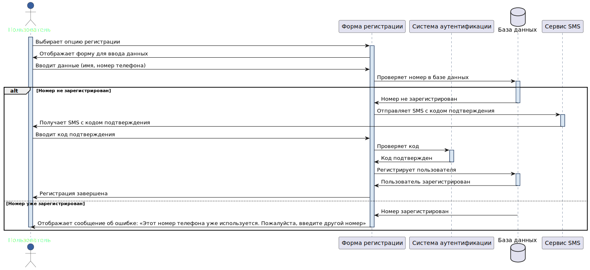
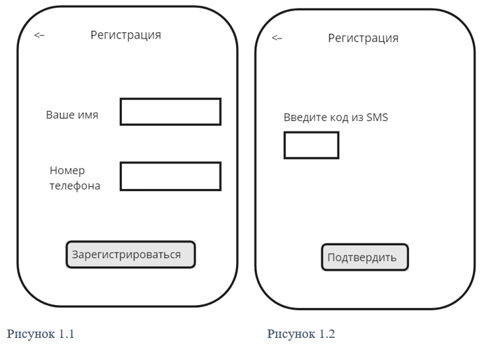

# Описание UseCase

## Описание UseCase, реализуемых в рамках MVP
### Use Cases в рамках MVP

#### UC1: Регистрация пользователя

| Атрибут                    | Описание                                                                                      |
|----------------------------|-----------------------------------------------------------------------------------------------|
| ID и название              | UC1: Регистрация пользователя                                                                 |
| Описание                   | Позволяет новым пользователям создать учетную запись в системе.                               |
| Основные акторы            | Потенциальные пользователи                                                                    |
| Второстепенные акторы      | Система аутентификации                                                                        |
| Предусловия                | Пользователь не должен быть зарегистрирован в системе.                                        |
| Основной поток событий     | 1. Пользователь выбирает опцию регистрации.   2. Система отображает форму для ввода данных.   3. Пользователь вводит требуемые данные (имя, номер телефона).   4. Пользователь нажимает на кнопку для подтверждения регистрации.   5. Система проверяет номер в базе данных – номер не зарегистрирован.   6. Система отправляет SMS с кодом подтверждения на введенный номер телефона.   7. Пользователь вводит код подтверждения из SMS.   8. Система проверяет код и регистрирует пользователя. |
| Альтернативный поток событий 1 | Номер телефона уже зарегистрирован:   5. Система проверяет номер в базе данных – номер зарегистрирован.   6. Система отображает сообщение об ошибке: «Этот номер телефона уже используется. Пожалуйста, введите другой номер». |
| Альтернативный поток событий 2 | Неверный формат номера телефона:   3. Пользователь вводит требуемые данные (имя, номер телефона).   4. Система проверяет, что введен неверный формат номера телефона.   5. Система отображает сообщение об ошибке: «Некорректный формат номера телефона. Пожалуйста, проверьте введенные данные». |
| Альтернативный поток событий 3 | Не получено SMS с кодом подтверждения:   6. Система отправляет SMS с кодом подтверждения на введенный номер телефона.   7. Пользователь не получил SMS с кодом.   8. Система предлагает повторно отправить SMS с кодом через 1 минуту.   9. Пользователь нажимает на кнопку «Отправить SMS» |
| Постусловия                | Пользователь успешно зарегистрирован и может войти в систему.                                 |
| Триггеры                   | Пользователь выбирает "Зарегистрироваться".                                                   |
| Исключения                 | Номер телефона уже используется в системе.                                                   |
| Частота использования      | По мере появления новых пользователей.                                                        |
| Диаграмма                  | { width="100" }                                      |
| Макеты                     | { width="100" }                                                                   |

#### Задача 1.1: Реализация интерфейса регистрации

**Описание задачи:** Разработать и интегрировать интерфейс регистрации пользователя, включая форму для ввода имени и номера телефона. Пример макета – Рисунок 1.

**Тест-кейс 1.1.1: Проверка доступности формы регистрации (тестирование пользовательского интерфейса, положительный тест)**

**Шаги:**
1. Нажать на кнопку «Зарегистрироваться».
2. Дождаться полной загрузки страницы регистрации.

**Ожидаемый результат:** Форма регистрации загружается без ошибок, поля ввода активны.

**Тест-кейс 1.1.2: Ввод валидных данных (валидационное тестирование, положительный тест)**

**Шаги:**
1. Ввести корректное имя, например, Иван.
2. Ввести мобильный номер телефона, например, +79312009900.
3. Нажать на кнопку "Зарегистрироваться" для отправки данных.

**Ожидаемый результат:** Данные принимаются без ошибок, пользователь переходит к следующему шагу (получение SMS).

**Тест-кейс 1.1.3: Попытка отправить пустую форму (валидационное тестирование, отрицательный тест)**

**Шаги:**
1. Перейти на страницу регистрации.
2. Оставить поля ввода имени и номера телефона пустыми.
3. Нажать на кнопку "Зарегистрироваться" без ввода каких-либо данных в форму.
4. Наблюдать за реакцией системы.

**Ожидаемый результат:** 
* Система выдает сообщение о необходимости заполнения всех полей.
* Кнопка "Зарегистрироваться" задизейблена.

#### Задача 1.2: Верификация номера телефона и отправка SMS

**Описание задачи:** Реализовать проверку уникальности номера телефона в базе данных и механизм отправки SMS с кодом подтверждения. Пример макета – Рисунок 2.

**Тест-кейс 1.2.1: Проверка на уникальность номера телефона (валидационное тестирование, отрицательный тест)**

**Шаги:**
1. Перейти на форму регистрации.
2. Ввести имя и номер телефона, который уже используется другим пользователем в системе.
3. Нажать на кнопку "Зарегистрироваться".

**Ожидаемый результат:** 
* Система идентифицирует, что введенный номер телефона уже зарегистрирован. 
* Пользователь получает сообщение об ошибке: "Этот номер телефона уже используется. Пожалуйста, введите другой номер."

**Тест-кейс 1.2.2: Отправка SMS на валидный номер (интеграционное тестирование, положительный тест)**

**Шаги:**
1. Перейти на форму регистрации.
2. Ввести имя и уникальный номер телефона, который не используется в системе.
3. Нажать на кнопку "Зарегистрироваться".

**Ожидаемый результат:** 
* Система проверяет, что номер телефона не зарегистрирован в базе данных и принимает его.
* На введенный номер телефона отправляется SMS с кодом подтверждения.
* Пользователь получает уведомление на странице о том, что SMS с кодом подтверждения было отправлено.

**Тест-кейс 1.2.3: Ввод невалидного номера телефона (валидационное тестирование, отрицательный тест)**

**Шаги:**
1. Перейти на форму регистрации.
2. Ввести в форму регистрации имя и невалидный номер телефона (например, слишком мало цифр или присутствуют буквы).
3. Нажать на кнопку "Зарегистрироваться".

**Ожидаемый результат:** 
* Система проверяет формат номера телефона и идентифицирует его как невалидный.
* Пользователь получает сообщение об ошибке: "Некорректный формат номера телефона. Пожалуйста, проверьте введенные данные."

#### Задача 1.3: Обработка кода подтверждения и завершение регистрации

**Описание задачи:** Реализовать функционал для ввода и проверки кода из SMS и завершения процесса регистрации пользователя.

**Тест-кейс 1.3.1: Ввод корректного кода подтверждения (функциональное тестирование, положительный тест)**

**Шаги:**
1. Перейти на страницу ввода кода подтверждения, которая отображается после отправки SMS пользователю.
2. Ввести корректный код подтверждения, полученный в SMS.
3. Нажать на кнопку «Подтвердить».

**Ожидаемый результат:**
1. Система проверяет введенный код и подтверждает его правильность.
2. Регистрация завершается успешно, и пользователь автоматически перенаправляется на страницу подтверждения успешной регистрации.

**Тест-кейс 1.3.2: Ввод некорректного кода подтверждения (функциональное тестирование, отрицательный тест)**

**Шаги:**
1. Перейти на страницу ввода кода подтверждения, которая отображается после отправки SMS пользователю.
2. Ввести некорректный код подтверждения.
3. Нажать на кнопку «Подтвердить».

**Ожидаемый результат:**
* Система проверяет введенный код и определяет его как некорректный.
* На странице появляется сообщение об ошибке: "Неверный код подтверждения. Пожалуйста, попробуйте снова."
* Пользователь остается на странице ввода кода для повторной попытки.

**Тест-кейс 1.3.3: Истечение времени действия кода подтверждения (функциональное тестирование, отрицательный тест)**

**Шаги:**
1. Перейти на страницу ввода кода подтверждения после истечения времени действия кода (например, через 30 минут после получения).
2. Ввести код подтверждения, который был получен в SMS.
3. Нажать на кнопку «Подтвердить».

**Ожидаемый результат:**
* Система проверяет введенный код и определяет, что время его действия истекло.
* На странице появляется сообщение об ошибке: "Время действия кода истекло. Новый код был отправлен на ваш номер телефона."
* Система автоматически отправляет новый код на номер телефона пользователя для повторного ввода.

#### Критерии приемки для UC1

1. Пользователи могут успешно зарегистрироваться, вводя свое имя и номер телефона, и получить подтверждение через SMS.
2. Система корректно обрабатывает ошибки, такие как уже зарегистрированный номер телефона или невалидный ввод, предоставляя ясные сообщения об ошибке.
3. Интерфейс регистрации отзывчив и загружает формы без задержек, а все поля ввода активны и доступны.
4. Все введенные данные проверяются на корректность формата и уникальность номера телефона.
5. Все персональные данные передаются и хранятся в зашифрованном виде, обеспечивая конфиденциальность информации.
6. SMS с кодом подтверждения отправляется только после успешной валидации данных пользователя и приходит в течение нескольких минут.

#### Критерии готовности для UC1

1. Интерфейс регистрации пользователя полностью реализован и интегрирован с основной системой.
2. Система аутентификации успешно интегрирована с базой данных для проверки уникальности номеров телефонов.
3. Механизм отправки SMS для подтверждения регистрации реализован и функционирует корректно.
4. Все тест-кейсы выполнены, включая положительные и отрицательные сценарии, и успешно пройдены.
5. Все требования к безопасности и конфиденциальности выполнены, данные пользователей защищены.
6. Подготовлена и проверена документация для разработчиков и конечных пользователей по использованию функциональности регистрации.
