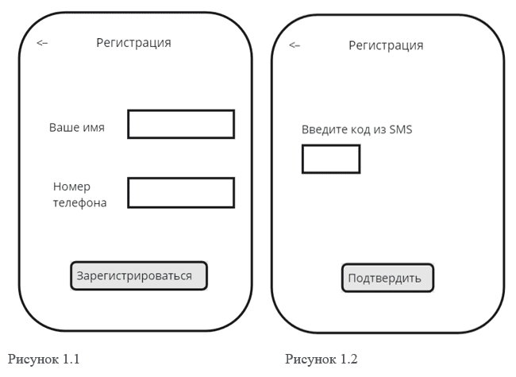

# Описание UseCase

## Описание UseCase, реализуемых в рамках MVP
### Use Cases в рамках MVP

#### UC1: Регистрация пользователя

| Атрибут                    | Описание                                                                                      |
|----------------------------|-----------------------------------------------------------------------------------------------|
| ID и название              | UC1: Регистрация пользователя                                                                 |
| Описание                   | Позволяет новым пользователям создать учетную запись в системе.                               |
| Основные акторы            | Потенциальные пользователи                                                                    |
| Второстепенные акторы      | Система аутентификации                                                                        |
| Предусловия                | Пользователь не должен быть зарегистрирован в системе.                                        |
| Основной поток событий     | 1. Пользователь выбирает опцию регистрации.   2. Система отображает форму для ввода данных.   3. Пользователь вводит требуемые данные (имя, номер телефона).   4. Пользователь нажимает на кнопку для подтверждения регистрации.   5. Система проверяет номер в базе данных – номер не зарегистрирован.   6. Система отправляет SMS с кодом подтверждения на введенный номер телефона.   7. Пользователь вводит код подтверждения из SMS.   8. Система проверяет код и регистрирует пользователя. |
| Альтернативный поток событий 1 | Номер телефона уже зарегистрирован:   5. Система проверяет номер в базе данных – номер зарегистрирован.   6. Система отображает сообщение об ошибке: «Этот номер телефона уже используется. Пожалуйста, введите другой номер». |
| Альтернативный поток событий 2 | Неверный формат номера телефона:   3. Пользователь вводит требуемые данные (имя, номер телефона).   4. Система проверяет, что введен неверный формат номера телефона.   5. Система отображает сообщение об ошибке: «Некорректный формат номера телефона. Пожалуйста, проверьте введенные данные». |
| Альтернативный поток событий 3 | Не получено SMS с кодом подтверждения:   6. Система отправляет SMS с кодом подтверждения на введенный номер телефона.   7. Пользователь не получил SMS с кодом.   8. Система предлагает повторно отправить SMS с кодом через 1 минуту.   9. Пользователь нажимает на кнопку «Отправить SMS» |
| Постусловия                | Пользователь успешно зарегистрирован и может войти в систему.                                 |
| Триггеры                   | Пользователь выбирает "Зарегистрироваться".                                                   |
| Исключения                 | Номер телефона уже используется в системе.                                                   |
| Частота использования      | По мере появления новых пользователей.                                                        |
| Диаграмма                  |                   |
| Макеты                     |               |

#### Задача 1.1: Реализация интерфейса регистрации

**Описание задачи:** Разработать и интегрировать интерфейс регистрации пользователя, включая форму для ввода имени и номера телефона. Пример макета – Рисунок 1.

**Тест-кейс 1.1.1: Проверка доступности формы регистрации (тестирование пользовательского интерфейса, положительный тест)**

**Шаги:**
1. Нажать на кнопку «Зарегистрироваться».
2. Дождаться полной загрузки страницы регистрации.

**Ожидаемый результат:** Форма регистрации загружается без ошибок, поля ввода активны.

**Тест-кейс 1.1.2: Ввод валидных данных (валидационное тестирование, положительный тест)**

**Шаги:**
1. Ввести корректное имя, например, Иван.
2. Ввести мобильный номер телефона, например, +79312009900.
3. Нажать на кнопку "Зарегистрироваться" для отправки данных.

**Ожидаемый результат:** Данные принимаются без ошибок, пользователь переходит к следующему шагу (получение SMS).

**Тест-кейс 1.1.3: Попытка отправить пустую форму (валидационное тестирование, отрицательный тест)**

**Шаги:**
1. Перейти на страницу регистрации.
2. Оставить поля ввода имени и номера телефона пустыми.
3. Нажать на кнопку "Зарегистрироваться" без ввода каких-либо данных в форму.
4. Наблюдать за реакцией системы.

**Ожидаемый результат:** 
* Система выдает сообщение о необходимости заполнения всех полей.
* Кнопка "Зарегистрироваться" задизейблена.

#### Задача 1.2: Верификация номера телефона и отправка SMS

**Описание задачи:** Реализовать проверку уникальности номера телефона в базе данных и механизм отправки SMS с кодом подтверждения. Пример макета – Рисунок 2.

**Тест-кейс 1.2.1: Проверка на уникальность номера телефона (валидационное тестирование, отрицательный тест)**

**Шаги:**
1. Перейти на форму регистрации.
2. Ввести имя и номер телефона, который уже используется другим пользователем в системе.
3. Нажать на кнопку "Зарегистрироваться".

**Ожидаемый результат:** 
* Система идентифицирует, что введенный номер телефона уже зарегистрирован. 
* Пользователь получает сообщение об ошибке: "Этот номер телефона уже используется. Пожалуйста, введите другой номер."

**Тест-кейс 1.2.2: Отправка SMS на валидный номер (интеграционное тестирование, положительный тест)**

**Шаги:**
1. Перейти на форму регистрации.
2. Ввести имя и уникальный номер телефона, который не используется в системе.
3. Нажать на кнопку "Зарегистрироваться".

**Ожидаемый результат:** 
* Система проверяет, что номер телефона не зарегистрирован в базе данных и принимает его.
* На введенный номер телефона отправляется SMS с кодом подтверждения.
* Пользователь получает уведомление на странице о том, что SMS с кодом подтверждения было отправлено.

**Тест-кейс 1.2.3: Ввод невалидного номера телефона (валидационное тестирование, отрицательный тест)**

**Шаги:**
1. Перейти на форму регистрации.
2. Ввести в форму регистрации имя и невалидный номер телефона (например, слишком мало цифр или присутствуют буквы).
3. Нажать на кнопку "Зарегистрироваться".

**Ожидаемый результат:** 
* Система проверяет формат номера телефона и идентифицирует его как невалидный.
* Пользователь получает сообщение об ошибке: "Некорректный формат номера телефона. Пожалуйста, проверьте введенные данные."

#### Задача 1.3: Обработка кода подтверждения и завершение регистрации

**Описание задачи:** Реализовать функционал для ввода и проверки кода из SMS и завершения процесса регистрации пользователя.

**Тест-кейс 1.3.1: Ввод корректного кода подтверждения (функциональное тестирование, положительный тест)**

**Шаги:**
1. Перейти на страницу ввода кода подтверждения, которая отображается после отправки SMS пользователю.
2. Ввести корректный код подтверждения, полученный в SMS.
3. Нажать на кнопку «Подтвердить».

**Ожидаемый результат:**
1. Система проверяет введенный код и подтверждает его правильность.
2. Регистрация завершается успешно, и пользователь автоматически перенаправляется на страницу подтверждения успешной регистрации.

**Тест-кейс 1.3.2: Ввод некорректного кода подтверждения (функциональное тестирование, отрицательный тест)**

**Шаги:**
1. Перейти на страницу ввода кода подтверждения, которая отображается после отправки SMS пользователю.
2. Ввести некорректный код подтверждения.
3. Нажать на кнопку «Подтвердить».

**Ожидаемый результат:**
* Система проверяет введенный код и определяет его как некорректный.
* На странице появляется сообщение об ошибке: "Неверный код подтверждения. Пожалуйста, попробуйте снова."
* Пользователь остается на странице ввода кода для повторной попытки.

**Тест-кейс 1.3.3: Истечение времени действия кода подтверждения (функциональное тестирование, отрицательный тест)**

**Шаги:**
1. Перейти на страницу ввода кода подтверждения после истечения времени действия кода (например, через 30 минут после получения).
2. Ввести код подтверждения, который был получен в SMS.
3. Нажать на кнопку «Подтвердить».

**Ожидаемый результат:**
* Система проверяет введенный код и определяет, что время его действия истекло.
* На странице появляется сообщение об ошибке: "Время действия кода истекло. Новый код был отправлен на ваш номер телефона."
* Система автоматически отправляет новый код на номер телефона пользователя для повторного ввода.

#### Критерии приемки для UC1

1. Пользователи могут успешно зарегистрироваться, вводя свое имя и номер телефона, и получить подтверждение через SMS.
2. Система корректно обрабатывает ошибки, такие как уже зарегистрированный номер телефона или невалидный ввод, предоставляя ясные сообщения об ошибке.
3. Интерфейс регистрации отзывчив и загружает формы без задержек, а все поля ввода активны и доступны.
4. Все введенные данные проверяются на корректность формата и уникальность номера телефона.
5. Все персональные данные передаются и хранятся в зашифрованном виде, обеспечивая конфиденциальность информации.
6. SMS с кодом подтверждения отправляется только после успешной валидации данных пользователя и приходит в течение нескольких минут.

### UC2: Вход в систему

| Атрибут | Описание |
|---------|----------|
| ID и название | UC2: Вход в систему |
| Описание | Аутентификация пользователя для доступа к системе. |
| Основные акторы | Зарегистрированные пользователи |
| Второстепенные акторы | Система аутентификации |
| Предусловия | Пользователь должен быть зарегистрирован. |
| Основной поток событий | 1. Пользователь нажимает на кнопку «Войти».   2. Система отображает форму для ввода данных, включая поле для ввода номера телефона и кнопку "Войти".   3. Пользователь вводит номер телефона.   4. Пользователь нажимает на кнопку "Войти".   5. Система проверяет введенные данные – номер телефона заведен в базе данных.   6. Система предоставляет доступ к профилю пользователя.   7. Пользователь получает доступ к своему профилю. |
| Альтернативный поток событий 1 | Неверный номер телефона:   5. Система проверяет введенные данные и не находит соответствия номера телефона в базе данных.   6. Система отображает сообщение об ошибке: «Неверный номер телефона. Пожалуйста, проверьте введенные данные и попробуйте снова».   7. Пользователь возвращается к форме входа и проверяет введенные данные. |
| Альтернативный поток событий 2 | Пустое поле ввода номера телефона:   2. Пользователь оставляет поле ввода номера телефона пустым и нажимает на кнопку "Войти".   3. Система проверяет поле ввода и обнаруживает, что оно пустое.   4. Система отображает сообщение об ошибке: "Это поле не может быть пустым".   5. Пользователь возвращается к форме входа и вводит номер телефона. |
| Постусловия | Пользователь успешно входит в систему. |
| Триггеры | Пользователь выбирает "Войти". |
| Исключения | Неверный номер телефона |
| Частота использования | Каждый раз при попытке пользователя войти в систему. |
| Диаграмма |  |
| Макеты |  |

#### Задача 2.1: Разработка интерфейса входа в систему

**Описание задачи:** Необходимо разработать пользовательский интерфейс для входа в систему, который включает: 
- Поле для ввода номера телефона.
- Кнопку "Войти".
- Сообщения об ошибках для неверных попыток входа.

**Тест-кейс 2.1.1: Проверка отображения формы входа (тестирование пользовательского интерфейса, положительный тест)**

**Шаги:**
1. Нажать на кнопку «Войти»
2. Оценить загрузку элементов страницы.

**Ожидаемый результат:**
- Страница загружается быстро и без ошибок.
- Поле для ввода номера телефона и кнопка "Войти" отображаются корректно.

**Тест-кейс 2.1.2: Попытка входа с пустым полем номера телефона (тестирование валидации, отрицательный тест)**

**Шаги:**
1. Оставить поле ввода номера телефона пустым.
2. Нажать на кнопку "Войти".

**Ожидаемый результат:** Система отображает сообщение об ошибке: "Это поле не может быть пустым".

#### Задача 2.2: Реализация логики аутентификации

**Описание задачи:** разработать бэкенд-логику для проверки номера телефона пользователя:
- Проверить наличие номера в базе данных.
- Реализовать безопасное хранение и проверку данных.
- Предусмотреть логирование попыток входа.

**Тест-кейс 2.2.1: Вход с верным номером телефона (функциональное тестирование, положительный тест)**

**Шаги:**
1. Ввести существующий в базе данных номер телефона.
2. Нажать "Войти".

**Ожидаемый результат:**
- Система успешно идентифицирует пользователя.
- Пользователь перенаправляется на главную страницу меню.

**Тест-кейс 2.2.2: Вход с неверным номером телефона (функциональное тестирование, отрицательный тест)**

**Шаги:**
1. Ввести номер телефона, которого нет в базе данных.
2. Нажать "Войти".

**Ожидаемый результат:** Система отображает сообщение об ошибке: "Номер телефона не найден".

#### Задача 2.3: Реализация управления ошибками при аутентификации

**Описание задачи:** необходимо разработать и интегрировать механизмы для управления ошибками, которые могут возникать во время процесса аутентификации пользователя:
- Обработка некорректно введенных данных 
- Предоставление четких инструкций для исправления ошибок
- Возможность повторного ввода данных без необходимости перезагрузки страницы.

**Тест-кейс 2.3.1: Проверка обработки неверного номера телефона (функциональное тестирование, отрицательный тест)**

**Шаги:**
1. Ввести неверный номер телефона.
2. Нажать "Войти".

**Ожидаемый результат:**
- Система определяет, что номер телефона введен некорректно.
- Пользователю отображается сообщение об ошибке рядом с полем ввода: "Неверный номер телефона. Пожалуйста, проверьте введенные данные и попробуйте снова".
- Предоставляется возможность исправить ввод без необходимости перезагрузки страницы.

**Тест-кейс 2.3.2: Валидация корректного повторного ввода номера телефона после ошибки (функциональное тестирование, положительный тест)**

**Шаги:**
1. После получения сообщения об ошибке корректно ввести номер телефона.
2. Нажать кнопку "Войти" снова.

**Ожидаемый результат:**
- Система успешно проверяет исправленный номер телефона.
- Пользователь получает доступ к своему профилю, процесс переходит к загрузке домашней страницы пользователя без перезагрузки или дополнительных задержек.

**Тест-кейс 2.3.3: Обработка множественных неверных попыток входа (функциональное тестирование, отрицательный тест)**

**Шаги:**
1. Ввести неверный номер телефона в форму входа и нажать "Войти".
2. Повторить шаг 1 пять раз с тем же или разными неверными номерами телефона.
3. Попытаться ввести верный номер телефона и нажать "Войти".

**Ожидаемый результат:**
- После нескольких неверных попыток (например, пяти), система должна автоматически блокировать дальнейшие попытки входа на некоторое время или до дополнительной верификации.
- Пользователь получает сообщение: "Ваш аккаунт временно заблокирован из-за множественных неверных попыток входа. Пожалуйста, попробуйте снова через 30 минут или обратитесь в службу поддержки".
- Даже при вводе верного номера телефона доступ в систему не предоставляется до истечения времени блокировки или до прохождения дополнительной процедуры верификации.

#### Критерии приемки для UC2:

1. Пользователи могут успешно войти в систему, используя свой зарегистрированный номер телефона.
2. Система корректно обрабатывает случаи, когда введенный номер телефона некорректен или отсутствует в базе данных, предоставляя ясные и точные сообщения об ошибке.
3. Время ответа системы на попытку входа не превышает 5 секунд.
4. Все процессы аутентификации обеспечивают безопасное хранение и передачу данных, используя современные методы шифрования и безопасности.
5. Интерфейс входа в систему должен быть понятным и удобным для пользователя, позволяя легко ввести необходимые данные и понять, какие действия требуются для входа.
6. Система должна эффективно проверять формат и наличие введенного номера телефона в базе данных.
7. Система должна корректно обрабатывать множественные попытки входа, включая блокировку пользователя после нескольких неудачных попыток для предотвращения несанкционированного доступа.

#### Критерии готовности для UC2:

1. Интерфейс входа в систему полностью реализован, оптимизирован и интегрирован с основной системой управления пользователями.
2. Система проверки номеров телефонов интегрирована с базой данных и все пользовательские данные защищены с использованием современных методов шифрования и защиты от атак.
3. Все компоненты системы прошли полный цикл тестирования (единичные, интеграционные и приемочные тесты) и документированы, включая архитектурные решения и пользовательские инструкции.
4. Система обеспечивает корректную обработку ошибок с четкими пользовательскими сообщениями и адаптирована для использования на различных устройствах и платформах.

1. Интерфейс регистрации пользователя полностью реализован и интегрирован с основной системой.
2. Система аутентификации успешно интегрирована с базой данных для проверки уникальности номеров телефонов.
3. Механизм отправки SMS для подтверждения регистрации реализован и функционирует корректно.
4. Все тест-кейсы выполнены, включая положительные и отрицательные сценарии, и успешно пройдены.
5. Все требования к безопасности и конфиденциальности выполнены, данные пользователей защищены.
6. Подготовлена и проверена документация для разработчиков и конечных пользователей по использованию функциональности регистрации.
